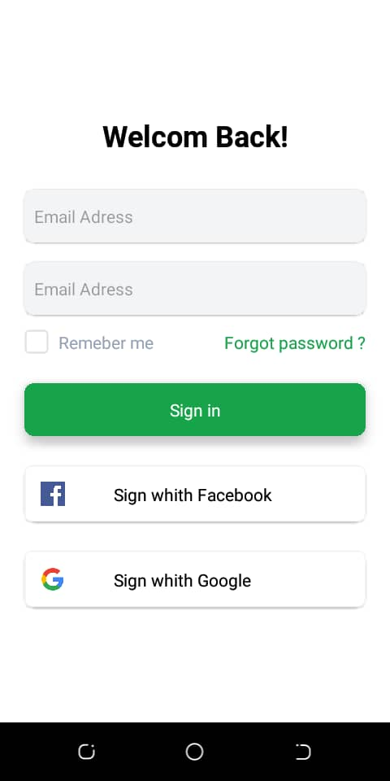

# Login Project

## Description

This project is a simple login interface developed with React Native. It serves as a demonstration of my skills in mobile application development. The `Login` component features a clean user interface that allows users to log in using their email and password, as well as sign in with their Facebook and Google accounts.

### Preview

Here is a screenshot of the user interface:

  

This project showcases the use of React Native components such as `TextInput`, `TouchableOpacity`, and `View`, as well as styling management with Tailwind CSS for React Native.
