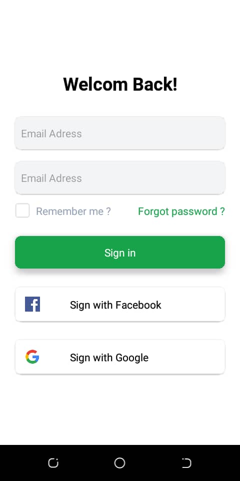

# Projet Login

## Description

Ce projet est une interface de connexion simple développée avec React Native. Il sert de démonstration de mes compétences en développement d'applications mobiles. Le composant `Login` présente une interface utilisateur épurée permettant aux utilisateurs de se connecter via leur adresse e-mail et mot de passe, ainsi que de se connecter avec leurs comptes Facebook et Google.

### Prévisualisation

Voici une capture d'écran de l'interface utilisateur :

  

Ce projet illustre l'utilisation de composants React Native tels que `TextInput`, `TouchableOpacity`, et `View`, ainsi que la gestion du style avec Tailwind CSS pour React Native.

